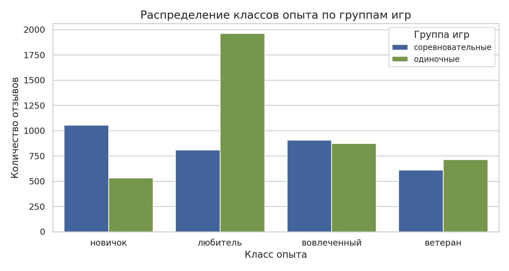
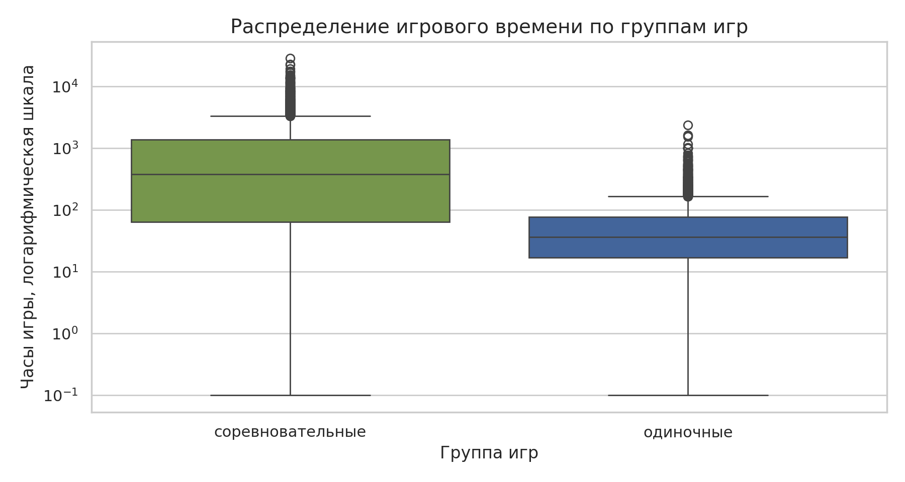
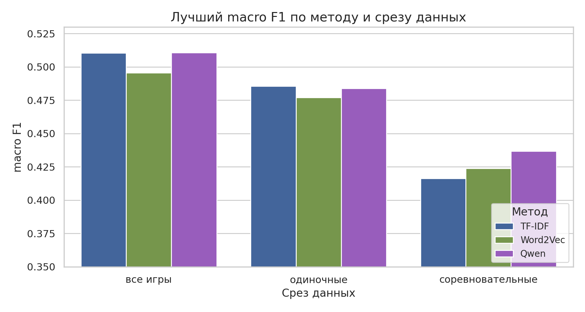
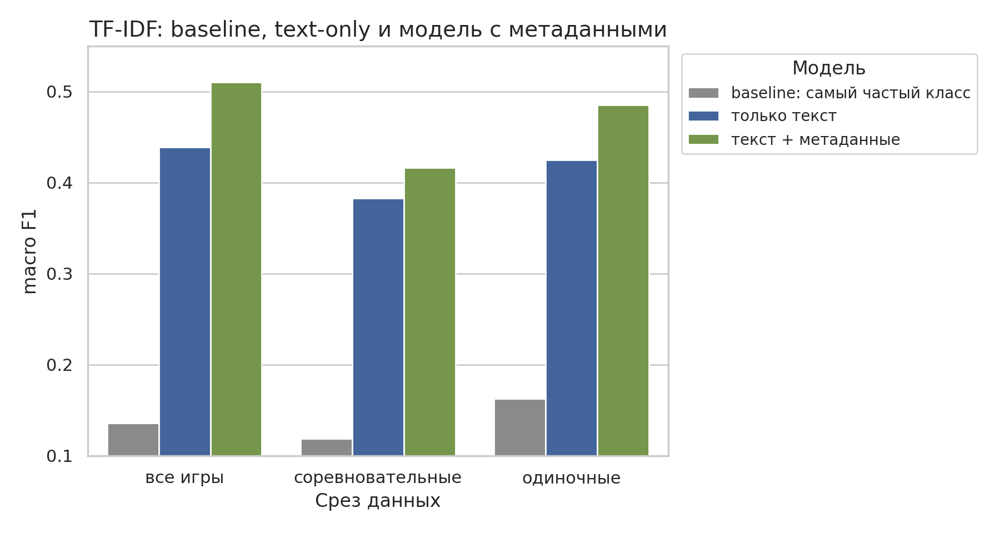
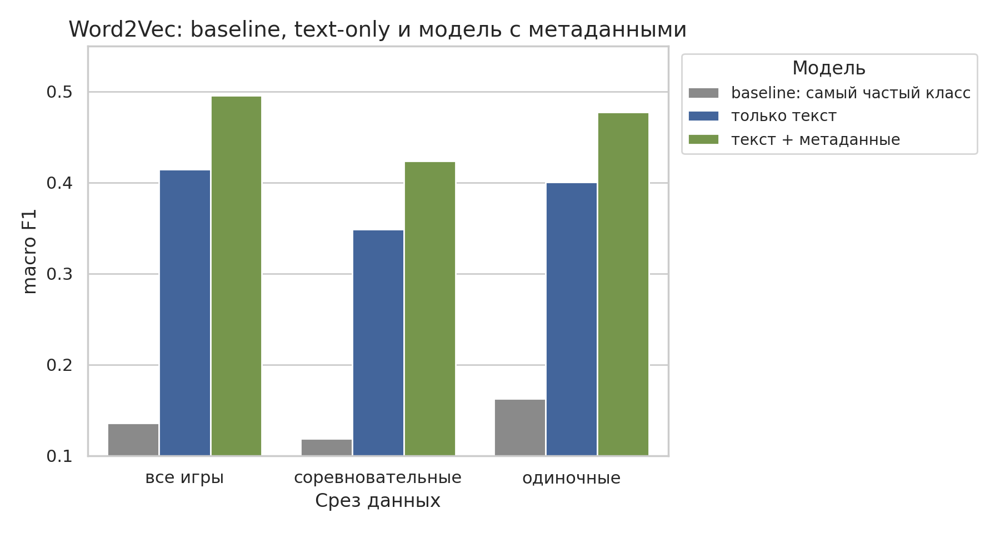
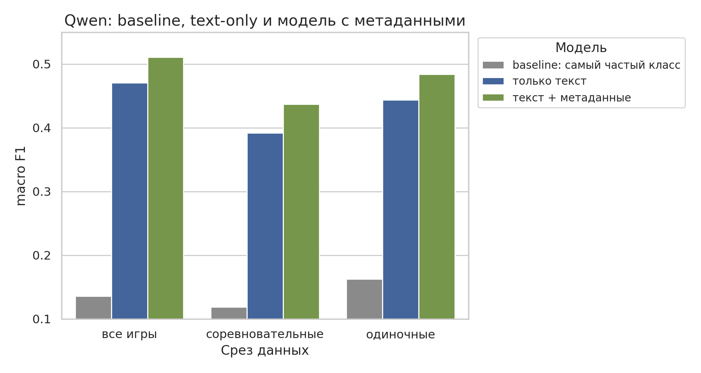

# Steam Review Experience Classifier

Проект по классификации игрового опыта автора отзыва на игру в Steam. Собственным скриптом из Steam собираются текст отзыва и публичные метаданные, затем по ним предсказывается один из классов опыта: `newbie`, `casual`, `engaged`, `veteran`.

## Быстрый старт

```powershell
python -m pip install -r requirements.txt
python scripts/collect_reviews.py # Сбор данных
python scripts/prepare_dataset.py # Подготовка данных
jupyter notebook
```

Ноутбуки:

- `notebooks/01_eda.ipynb` - разведочный анализ данных.
- `notebooks/02_tfidf_modeling.ipynb` - модель на основе TF-IDF.
- `notebooks/03_word2vec_modeling.ipynb` - модель на основе Word2Vec.
- `notebooks/04_qwen_embedding_modeling.ipynb` - модель на основе Qwen-эмбеддингов.

## Цель и метрики

Цель: предсказать класс игрового опыта пользователя по отзыву в Steam.

Целевая переменная: `experience_class`.

Основные метрики:

- `macro F1` - главная метрика, потому что классы несбалансированы.
- `accuracy` - дополнительная метрика.

Валидация во всех моделирующих ноутбуках:

- `train_test_split`
- `test_size=0.2`
- `stratify=y`
- `random_state=42`

## Данные

Данные собираются через публичный Steam endpoint:

`https://store.steampowered.com/appreviews/<appid>?json=1`

Текущие настройки сбора:

- `REVIEWS_PER_GAME = 1000`
- `GAME_GROUP = "all"`
- `LANGUAGE = "english"`
- `REVIEW_FILTER = "all"`
- `DAY_RANGE = 365`
- `review_type = "all"`
- `purchase_type = "all"`

Сохраняются только публичные поля:

- `appid`, `game`, `game_group`
- `recommendationid`, `review`
- `voted_up`, `votes_up`, `votes_funny`, `weighted_vote_score`, `comment_count`
- `steam_purchase`, `received_for_free`, `written_during_early_access`
- `timestamp_created`
- `author_num_games_owned`, `author_num_reviews`
- `playtime_forever`, `playtime_at_review`

## Группы игр

Игры разделены на две группы, потому что одинаковое количество часов означает разный опыт в одиночных и соревновательных играх.

`offline`:

- `The Witcher 3: Wild Hunt`
- `Red Dead Redemption 2`
- `God of War`
- `The Last of Us Part I`
- `BioShock Infinite`
- `Black Myth: Wukong`

`competitive`:

- `Counter-Strike 2`
- `Dota 2`
- `PUBG: Battlegrounds`
- `Apex Legends`
- `Team Fortress 2`
- `War Thunder`

## Классы опыта

Класс строится по `playtime_at_review`, если поле доступно, иначе по `playtime_forever`. Минуты переводятся в часы и затем размечаются разными правилами для `offline` и `competitive`.

Для `offline`:

| Класс | Диапазон часов |
|---|---:|
| `newbie` | до 10 |
| `casual` | 10-50 |
| `engaged` | 50-100 |
| `veteran` | 100+ |

Для `competitive`:

| Класс | Диапазон часов |
|---|---:|
| `newbie` | до 100 |
| `casual` | 100-500 |
| `engaged` | 500-2000 |
| `veteran` | 2000+ |

## Подготовка данных

Подготовка выполняется в `scripts/prepare_dataset.py`.

Шаги:

- удаляются дубликаты по `recommendationid`;
- чистятся переносы строк и лишние пробелы в тексте;
- удаляются пустые отзывы;
- поля с голосами, счетчиками и временем игры преобразуются в числовой формат;
- часы переводятся из минут в часы;
- создаётся `experience_class`;
- добавляются `review_length_chars` и `review_length_words`;
- удаляются слишком короткие отзывы.

Текущий фильтр коротких отзывов:

- `MIN_REVIEW_WORDS = 20`
- `MIN_REVIEW_CHARS = 100`

## Разведочный анализ (EDA)

Распределение классов показывает, что целевая переменная несбалансирована: часть классов встречается заметно чаще других, поэтому основной метрикой выбран `macro F1`.



Распределение игрового времени отличается между `offline` и `competitive`: в соревновательных играх типичное число часов выше, поэтому для двух групп используются разные границы классов.



## Признаки

Текстовые признаки:

- TF-IDF: униграммы и биграммы из поля `review`;
- Word2Vec: среднее векторов токенов, обученных на train-части данных;
- Qwen: эмбеддинг текста из модели `Qwen/Qwen3-Embedding-0.6B`.

Метаданные:

- `game`
- `game_group`
- `voted_up`
- `votes_up`
- `votes_funny`
- `weighted_vote_score`
- `comment_count`
- `steam_purchase`
- `received_for_free`
- `written_during_early_access`
- `author_num_games_owned`
- `author_num_reviews`

Из финальных моделей убраны:

- `review_length_chars`
- `review_length_words`

Причина: при сравнении вариантов модели на общем срезе показали лучший результат без признаков длины отзыва.

## Моделирование

Во всех экспериментах сравниваются три типа моделей:

- `dummy_most_frequent` - baseline, который всегда предсказывает самый частый класс;
- `*_only` - модель только на текстовом представлении отзыва;
- `*_metadata` - модель на текстовом представлении отзыва и метаданных.

Для классификации во всех содержательных моделях используется `LogisticRegression`:

```python
LogisticRegression(
    class_weight="balanced",
    max_iter=2000,
    random_state=42,
)
```

Метаданные обрабатываются одинаково во всех `*_metadata` моделях:

- числовые признаки: `SimpleImputer(strategy="median")` и `StandardScaler(with_mean=False)`;
- категориальные признаки: `SimpleImputer(strategy="most_frequent")` и `OneHotEncoder(handle_unknown="ignore")`.

### TF-IDF

В `notebooks/02_tfidf_modeling.ipynb` текст отзыва представляется через TF-IDF по словам и биграммам:

```python
TfidfVectorizer(
    min_df=3,
    max_df=0.85,
    ngram_range=(1, 2),
    max_features=50000,
)
```

Сравниваются модели `text_only` и `text_metadata`.

### Word2Vec

В `notebooks/03_word2vec_modeling.ipynb` текст отзыва представляется как среднее Word2Vec-векторов токенов. Word2Vec обучается только на train-части.

Сравниваются модели `word2vec_only` и `word2vec_metadata`.

### Qwen Embeddings

В `notebooks/04_qwen_embedding_modeling.ipynb` текст отзыва представляется эмбеддингом из `Qwen/Qwen3-Embedding-0.6B`. Модель Qwen используется только как готовый extractor признаков и не дообучается.

Сравниваются модели `qwen_only` и `qwen_metadata`.

Эмбеддинги кэшируются в `data/processed/embeddings`, чтобы не пересчитывать их при каждом запуске ноутбука.

## Текущие результаты

Сохраненные результаты из ноутбуков:

| Срез | Лучшая TF-IDF модель | macro F1 | Лучшая Word2Vec модель | macro F1 | Лучшая Qwen модель | macro F1 |
|---|---|---:|---|---:|---|---:|
| `all` | `text_metadata` | 0.510442 | `word2vec_metadata` | 0.495562 | `qwen_metadata` | 0.510654 |
| `offline` | `text_metadata` | 0.485411 | `word2vec_metadata` | 0.476990 | `qwen_metadata` | 0.483772 |
| `competitive` | `text_metadata` | 0.416143 | `word2vec_metadata` | 0.423781 | `qwen_metadata` | 0.436692 |

Краткий вывод:

- на общем срезе Qwen и TF-IDF дают практически одинаковый результат, при этом Qwen совсем немного выше;
- на `competitive` Qwen показывает лучший результат среди всех подходов;
- на `offline` TF-IDF остается немного сильнее Qwen и Word2Vec;
- Word2Vec уступает TF-IDF и Qwen на общем срезе, но немного обгоняет TF-IDF на `competitive`;
- метаданные дают сильный вклад во всех подходах.



Сравнение внутри каждого подхода показывает вклад текстового представления и метаданных относительно простого baseline.







## Анализ ошибок

В ноутбуках с моделями сохраняются:

- сводная таблица метрик по `all`, `offline`, `competitive`;
- сравнение `macro_f1` моделей по группам;
- confusion matrix для лучшей модели в каждом срезе;
- classification report для каждого среза;
- примеры неверных предсказаний.

В `02_tfidf_modeling.ipynb` дополнительно выводятся ключевые слова классов в `text_only` модели.

## Риски и ограничения

- Отзывы в Steam часто мемные, эмоциональные и короткие, поэтому по ним сложно понять игровой опыт автора.
- `playtime_forever` может быть больше, чем опыт на момент написания отзыва, если `playtime_at_review` недоступен.
- Классы могут быть несбалансированы, поэтому `macro F1` важнее `accuracy`.
- Границы классов экспертные и могут вносить шум около порогов.

## Структура проекта

```text
ml-steam-reviews/
├── data/
│   ├── raw/                         # сырые данные, не коммитятся
│   └── processed/                   # подготовленный датасет и кэш эмбеддингов, не коммитятся
├── docs/
│   ├── figures/                     # графики
│   └── presentation.pdf             # презентация
├── notebooks/
│   ├── 01_eda.ipynb                 # разведочный анализ данных и визуализации
│   ├── 02_tfidf_modeling.ipynb      # модель на основе TF-IDF
│   ├── 03_word2vec_modeling.ipynb   # модель на основе Word2Vec
│   └── 04_qwen_embedding_modeling.ipynb # модель на основе Qwen-эмбеддингов
├── scripts/
│   ├── collect_reviews.py           # сбор отзывов через публичный Steam endpoint
│   └── prepare_dataset.py           # очистка данных и создание целевой переменной
├── requirements.txt                 # зависимости проекта
└── README.md                        # описание проекта
```
